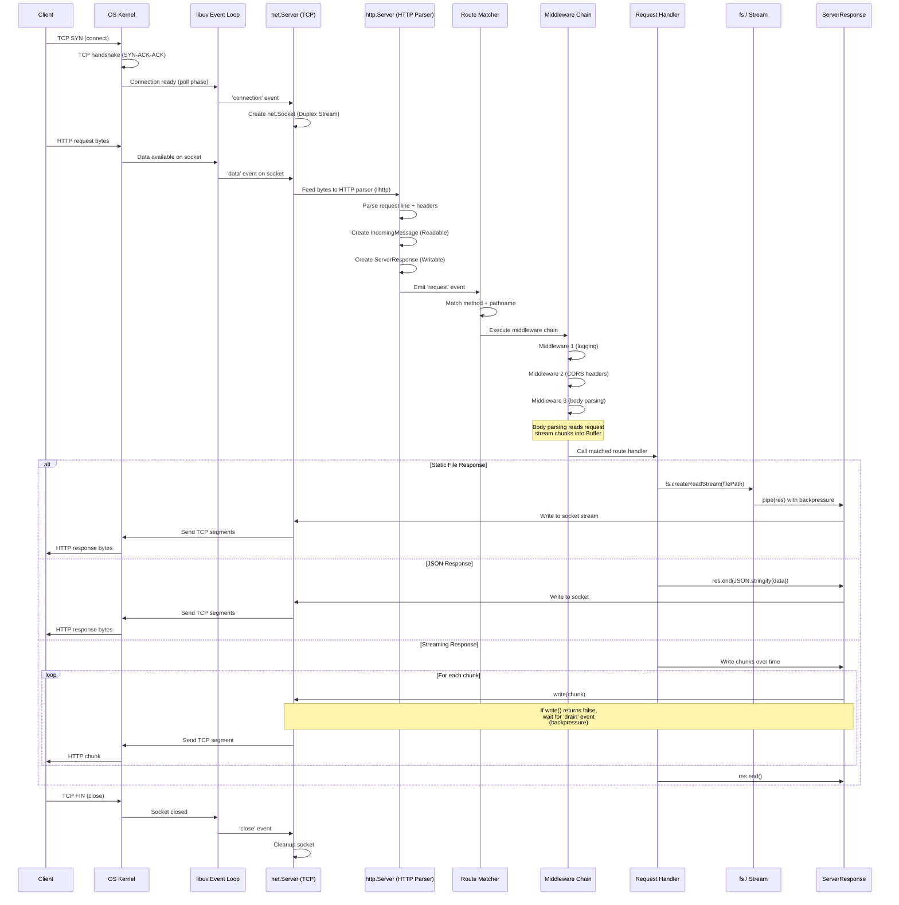
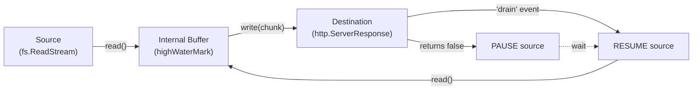

# Data Flow — HTTP Request Lifecycle

> The journey of an HTTP request from TCP packet to response stream, traced through Node.js internals.

---

## Request Lifecycle Diagram

---

## Phase-by-Phase Breakdown

### 1. TCP Connection (Kernel + libuv)
- Client sends TCP SYN packet
- OS kernel completes the three-way handshake (SYN → SYN-ACK → ACK)
- libuv detects the new connection during the **poll phase** of the event loop
- `net.Server` emits `'connection'` event with a new `net.Socket` (Duplex Stream)

### 2. HTTP Parsing (llhttp + http module)
- Raw bytes arrive on the TCP socket via `'data'` events
- Node.js feeds bytes to **llhttp** (the HTTP parser, written in C)
- llhttp parses the request line (`GET /api/users HTTP/1.1`) and headers
- `http.Server` creates:
  - `IncomingMessage` (Readable Stream) — the request
  - `ServerResponse` (Writable Stream) — the response
- Emits the `'request'` event with `(req, res)`

### 3. Routing
- The request handler matches `req.method` + `req.url` against registered routes
- Route parameters (`:id`) are extracted from the URL path
- Query parameters are parsed from the URL search string

### 4. Middleware Chain
- Each middleware receives `(req, res, next)`
- Middleware executes in registration order
- Common middleware: logging, CORS, body parsing, authentication
- Body parsing collects request body chunks (Buffers) and parses based on `Content-Type`

### 5. Handler Execution
- The matched route handler runs
- Can respond in three ways:
  - **Buffered:** `res.end(data)` — entire response in one call
  - **Piped:** `fs.createReadStream().pipe(res)` — stream a file
  - **Chunked:** Multiple `res.write()` calls followed by `res.end()`

### 6. Response Streaming
- `ServerResponse` is a Writable Stream wrapping the TCP socket
- Backpressure propagates: if the TCP send buffer is full, `write()` returns `false`
- Producer must pause and wait for `'drain'` before writing more
- Response headers include `Content-Type`, `Content-Length` (if known), or `Transfer-Encoding: chunked`

### 7. Connection Close
- Client or server initiates TCP FIN
- `'close'` event emitted on the socket
- Resources (file descriptors, buffers) are cleaned up

---

## Backpressure Flow

When the destination cannot keep up:
1. `write()` returns `false` (internal buffer exceeds `highWaterMark`)
2. The source **pauses** reading
3. The destination drains its buffer and emits `'drain'`
4. The source **resumes** reading
5. `pipeline()` handles this automatically; `pipe()` handles it mostly (but doesn't propagate errors)
