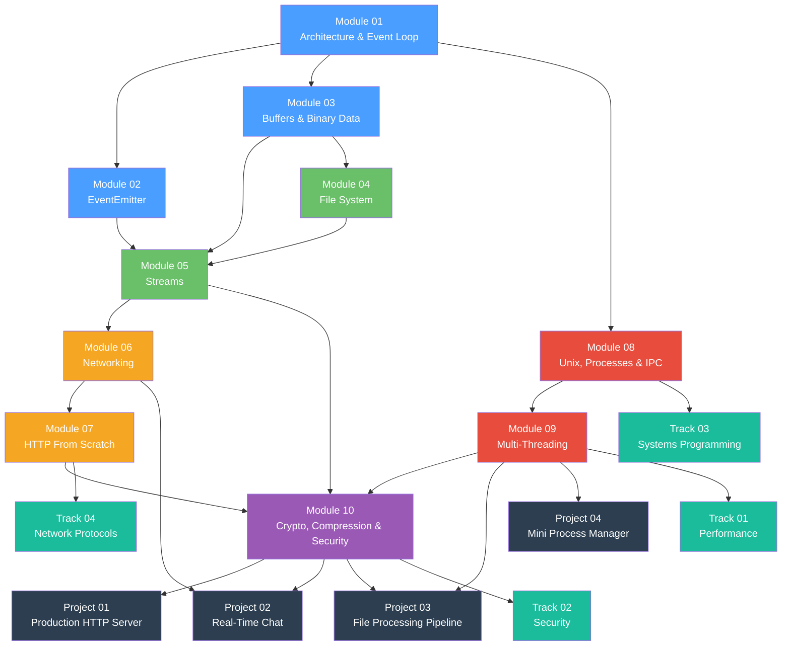

# Module Dependencies

> How the 10 course modules build on each other. Complete modules in order for the best learning experience.

---

## Dependency Diagram



---

## Module Progression Tiers

### Tier 1 — Foundations (Modules 01–03)
These three modules establish the core primitives everything else is built on.

| Module | Concepts | Why First |
|--------|----------|-----------|
| 01 Architecture | Event loop, V8, libuv, module system | You can't understand Node.js without understanding how it executes code |
| 02 EventEmitter | Events, listeners, observer pattern | Every I/O object in Node.js is an EventEmitter |
| 03 Buffers | Binary data, encodings, memory | All I/O operations pass through Buffers |

### Tier 2 — I/O Primitives (Modules 04–05)
File system and streams use everything from Tier 1.

| Module | Depends On | Why This Order |
|--------|-----------|----------------|
| 04 File System | 01 (async model), 03 (Buffers) | File operations return/accept Buffers, rely on the event loop |
| 05 Streams | 02 (EventEmitter), 03 (Buffers), 04 (fs) | Streams extend EventEmitter, process Buffers, and wrap fs operations |

### Tier 3 — Network (Modules 06–07)
Networking and HTTP build on streams and binary data.

| Module | Depends On | Why This Order |
|--------|-----------|----------------|
| 06 Networking | 03 (Buffers), 05 (Streams) | TCP sockets are Duplex Streams carrying binary data |
| 07 HTTP | 06 (TCP), 05 (Streams) | HTTP is a protocol on top of TCP; req/res are Streams |

### Tier 4 — System (Modules 08–09)
Process management and threading are advanced topics requiring solid foundations.

| Module | Depends On | Why This Order |
|--------|-----------|----------------|
| 08 Unix & Processes | 01 (event loop), 05 (Streams) | Child process stdio are Streams; understanding the event loop is critical for IPC |
| 09 Multi-Threading | 01 (event loop), 03 (Buffers), 08 (processes) | Need to understand single-threaded model before adding threads; SharedArrayBuffer relates to Buffers |

### Tier 5 — Security & Production (Module 10)
The capstone module that ties everything together.

| Module | Depends On | Why Last |
|--------|-----------|----------|
| 10 Crypto/Compression/Security | 05 (Streams), 07 (HTTP), 09 (threads) | Crypto operations are Transform Streams; TLS wraps HTTP; some crypto benefits from worker threads |

---

## Progressive Project Dependencies

Each step of "Build Your Own HTTP Framework" requires the corresponding module:

```
Step 01 (Event Dispatcher)     ← Module 01
Step 02 (Middleware Chain)     ← Module 02 + Step 01
Step 03 (Body Parsing)         ← Module 03 + Step 02
Step 04 (Static Files)         ← Module 04 + Step 03
Step 05 (Streaming Responses)  ← Module 05 + Step 04
Step 06 (TCP Foundation)       ← Module 06 + Step 05
Step 07 (HTTP Protocol)        ← Module 07 + Step 06
Step 08 (Process Workers)      ← Module 08 + Step 07
Step 09 (Thread Workers)       ← Module 09 + Step 08
Step 10 (HTTPS + Compression)  ← Module 10 + Step 09
```
