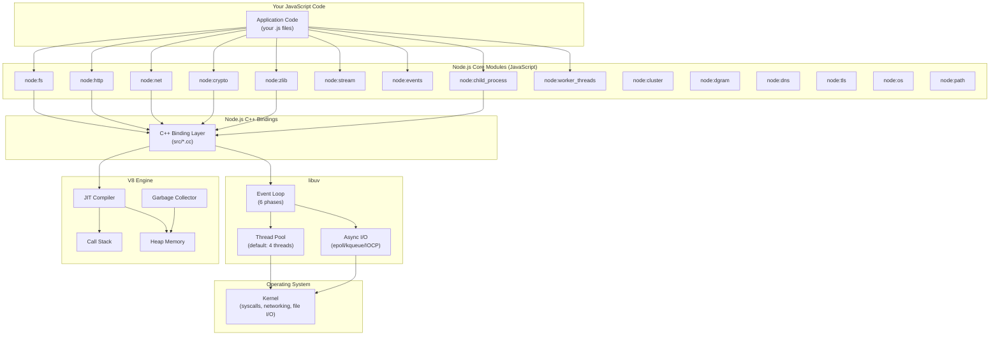

# System Overview — Node.js Runtime Architecture

> How V8, libuv, and the core modules fit together to form the Node.js runtime.

---

## Architecture Diagram



---

## Key Relationships

### V8 Engine
- **Executes** all JavaScript code (your code + core module JS code)
- **Manages** the call stack, heap memory, and garbage collection
- **Optimizes** hot code paths via JIT compilation, hidden classes, and inline caching
- **Single-threaded** — one call stack, one thread of JS execution (per isolate)

### libuv
- **Provides** the event loop that drives all asynchronous operations
- **Manages** a thread pool (default 4 threads, configurable via `UV_THREADPOOL_SIZE`) for blocking operations
- **Abstracts** OS-specific async I/O: epoll (Linux), kqueue (macOS), IOCP (Windows)
- **Handles** timers, TCP/UDP sockets, file system operations, DNS, child processes

### C++ Bindings
- **Bridge** between JavaScript (V8) and C/C++ (libuv, OpenSSL, zlib)
- Each core module has a JS layer (the API you call) and a C++ layer (the actual implementation)
- Example: `fs.readFile()` → JavaScript API → C++ binding → libuv → kernel syscall

### Core Modules
- **JavaScript layer** provides the developer-facing API
- **C++ layer** does the actual work via libuv or other C libraries
- `node:events` (EventEmitter) is the foundation — `Stream`, `http.Server`, `net.Socket` all extend it
- `node:stream` is built on `node:events` and underpins `node:fs`, `node:http`, `node:net`, `node:zlib`, `node:crypto`

---

## Module Dependency Chain

```
events (EventEmitter)
  └── stream (Readable, Writable, Duplex, Transform)
        ├── fs (createReadStream, createWriteStream)
        ├── net (Socket)
        │     └── http (IncomingMessage, ServerResponse)
        │           └── https (via tls)
        ├── zlib (createGzip, createDeflate, createBrotli)
        ├── crypto (Cipher, Decipher, Hash)
        └── tls (TLSSocket)
```
